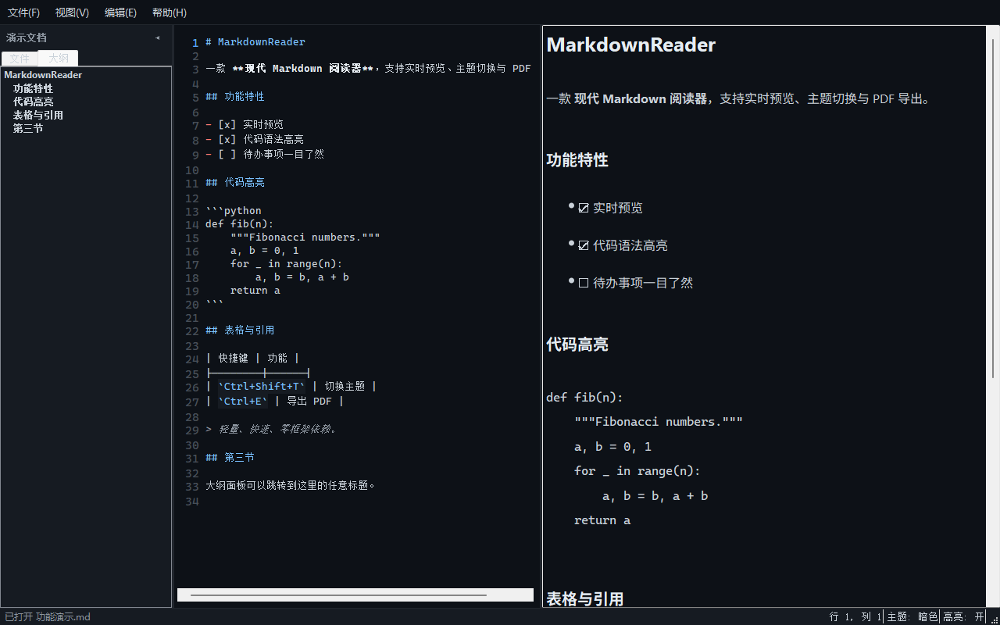
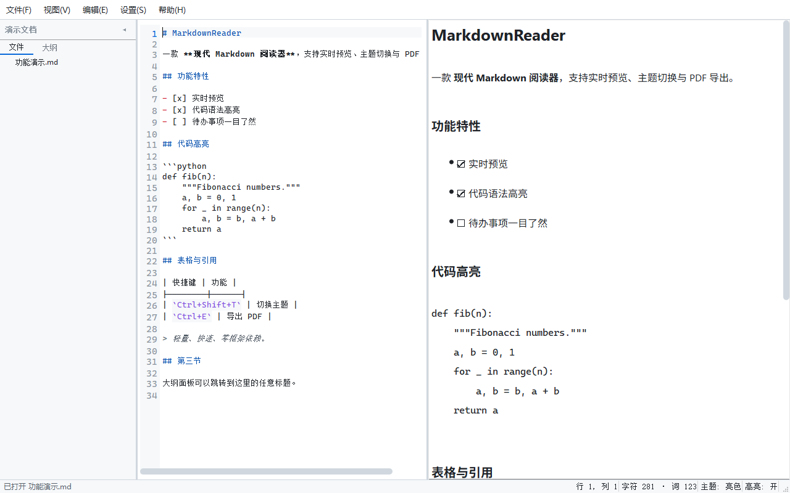

# MarkdownReader

A modern Markdown reader with live preview, dark/light themes, and PDF export — lightweight, zero framework dependencies.



*Dark theme with the heading outline panel; light theme below.*



## Features

- **Live Preview** — Real-time rendered markdown on a lightweight `QTextBrowser` panel (no bundled browser engine, fast startup)
- **Heading Outline** — Sidebar tab listing all headings; click to jump anywhere in the document
- **File Browser** — Sidebar tree view for navigating project files
- **Code Highlighting** — Pygments-powered syntax highlighting that follows the theme (`github-dark` palette on the dark theme, `default` on light), toggle with `Ctrl+Shift+H`
- **Task Lists** — `- [ ]` / `- [x]` items render as checkboxes
- **Local Images** — Relative image paths (``) resolve against the opened file's folder; remote images are not fetched (the preview engine is offline by design)
- **GitHub-style Paragraphs** — Single newlines don't break lines by default; toggle in the View menu if you prefer hard-wrapping
- **Dark/Light Themes** — Toggle between themes with `Ctrl+Shift+T`; editor, preview, and chrome all follow
- **PDF Export** — Export the current document to PDF with `Ctrl+E`
- **Search** — Regex-capable find bar with `Ctrl+F`
- **Recent Files** — Quick access to the last 10 opened files (File menu)
- **Drag & Drop** — Drag markdown files onto the window to open them
- **Encoding Detection** — Opens UTF-8, UTF-8 BOM, and GB18030/GBK/GB2312 files automatically (status bar shows the detected encoding); never fails to open a file

## Requirements

- Python 3.10+
- PyQt5
- Pygments ≥ 2.17
- Markdown

### Supported file types

`.md` `.markdown` `.mdown` `.mkd` `.mkdn` `.mdwn` `.livemd` `.qmd` `.rmd` `.txt` `.text` `.rst` — all rendered as Markdown.

## Installation

```bash
pip install -r requirements.txt
```

## Usage

```bash
# Run from project root
python -m markdownreader

# Or with a file argument
python -m markdownreader README.md

# Or via the entry point (after pip install -e .)
markdownreader
```

## Keyboard Shortcuts

| Shortcut | Action |
|----------|--------|
| `Ctrl+O` | Open file |
| `Ctrl+S` | Save file |
| `Ctrl+Shift+S` | Save as |
| `Ctrl+N` | New file |
| `Ctrl+W` | Close file |
| `Ctrl+B` | Toggle sidebar |
| `Ctrl+Shift+T` | Toggle theme |
| `Ctrl+Shift+H` | Toggle code highlighting |
| `Ctrl+F` | Find |
| `F3` / `Shift+F3` | Find next / previous |
| `Ctrl++` / `Ctrl+-` | Zoom in / out |
| `Ctrl+0` | Reset zoom |
| `Ctrl+E` | Export PDF |
| `F5` | Reload preview |
| `Ctrl+1` | Focus editor |
| `Ctrl+2` | Focus preview |
| `Escape` | Close search bar |

## Packaging

### Portable EXE (Recommended)

```bash
# Windows - double-click build.bat, or:
build.bat
```

Output: `dist\MarkdownReader\MarkdownReader.exe`

### With PyInstaller (Manual)

```bash
pip install pyinstaller
pyinstaller MarkdownReader.spec
```

### Automated releases

Pushing a `v*` tag (e.g. `v1.1.0`) triggers GitHub Actions to build the portable EXE on Windows and attach it to a GitHub release automatically.

### As a wheel

```bash
pip install build
python -m build
pip install dist/markdownreader-1.1.0-py3-none-any.whl
```

## Project Structure

```
MarkdownReader/
├── .github/workflows/release.yml   # Tag-driven release build
├── LICENSE
├── MarkdownReader.spec             # PyInstaller spec (onedir, windowed)
├── build.bat
├── docs/                           # Screenshots
├── pyproject.toml
├── requirements.txt
└── markdownreader/
    ├── __init__.py                 # Version
    ├── __main__.py
    ├── main.py                     # Entry point with crash handler
    ├── app.py                      # QApplication bootstrap
    ├── main_window.py              # Window assembly, menus, state
    ├── editor.py                   # Editor with line numbers + markdown highlighting
    ├── preview.py                  # QTextBrowser preview panel
    ├── sidebar.py                  # File tree + heading outline
    ├── search_bar.py
    ├── renderer.py                 # Markdown → themed HTML
    ├── pdf_export.py
    ├── settings.py                 # QSettings wrapper
    └── utils.py
```

## License

[MIT](LICENSE)
